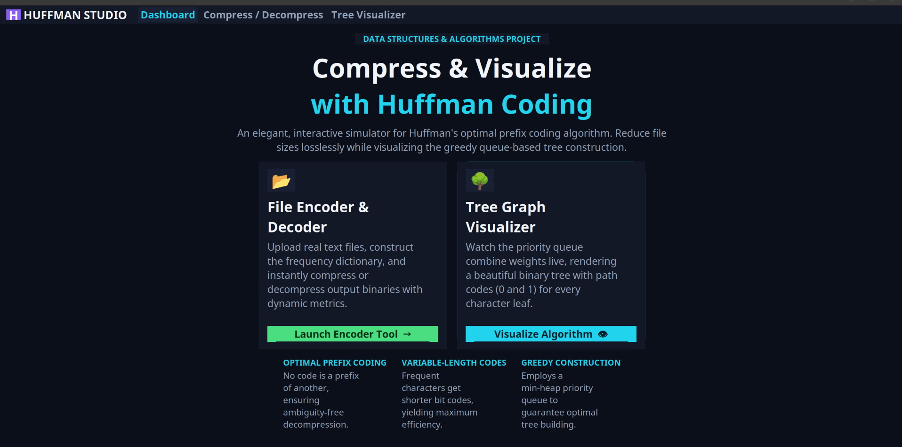
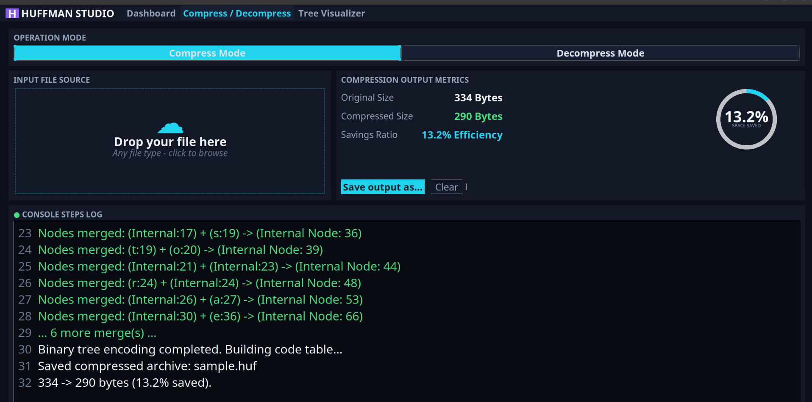
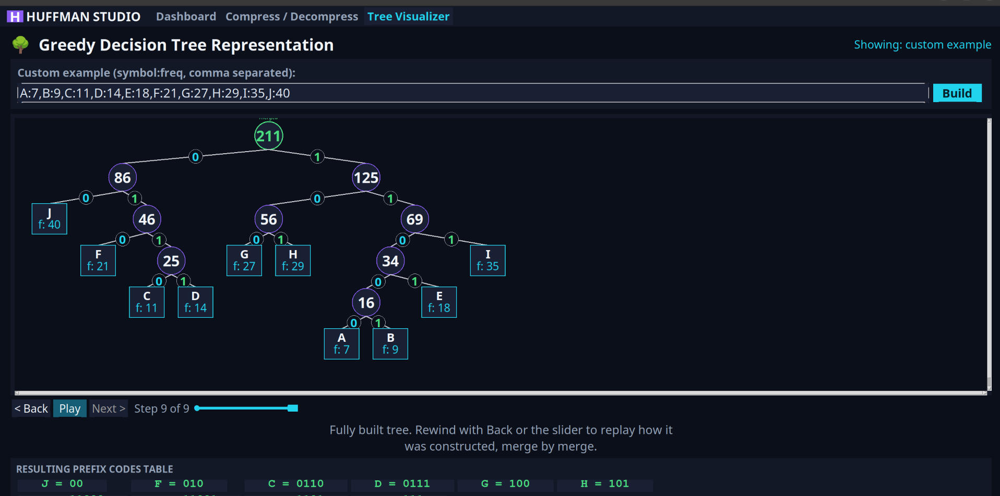
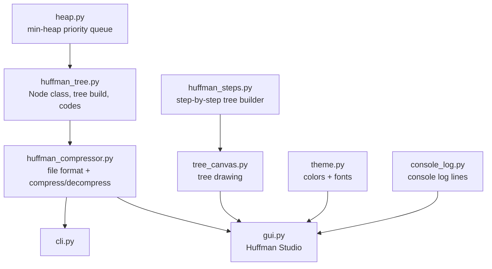

<div align="center">

# 🌲 HuffForge

### A general-purpose file compressor forged around a hand-built Huffman binary tree

*Compress **any** file, watch the algorithm build itself merge-by-merge, and see exactly why it works.*


</div>

---

## What is HuffForge?

HuffForge is a working upgrade of an earlier tkinter Huffman-coding project — same core idea,
but rebuilt from the ground up on a **hand-written min-heap** and a real **Huffman binary tree**,
with the bugs fixed and extended into an actual usable "zipper."

It compresses **any file type** — not just `.txt` — restores the original file extension
automatically on decompress, and ships with both a **CLI** and a full **GUI**, plus a way to
print (and visually replay) the Huffman tree itself so the data structure you built is never
a black box.

At its heart, this is a Data Structures & Algorithms project: a real, working demonstration of
how a **greedy algorithm** + a **priority queue (min-heap)** + a **full binary tree** combine to
produce optimal, ambiguity-free **prefix codes** — and then that theory is wrapped in a file
format, a command line tool, and a GUI you can actually use on real files.

---

## ✨ Highlights

| | |
|---|---|
| 📦 **Universal compression** | Works on `.txt`, `.png`, `.pdf`, literally any byte stream |
| 🧠 **Hand-rolled data structures** | A real min-heap priority queue + Huffman binary tree, not `heapq` shortcuts |
| 🔁 **Lossless round-trip** | Original file extension and content restored exactly on decompress |
| 🖥️ **Dual interface** | Full-featured CLI *and* a tabbed, dark-themed desktop GUI ("Huffman Studio") |
| 🌳 **Tree visualizer** | Rebuild the same tree merge-by-merge with Back / Next / Play / slider playback |
| 📜 **Real console log** | Compression stats and merge steps generated from the actual run, not placeholder text |
| 🧪 **Tested edge cases** | Single-repeated-byte files, corrupted archives, arbitrary binary data, and more |

---

## 📸 Screenshots

<div align="center">

### Dashboard
*Entry point into the two core tools, plus a quick primer on what makes Huffman coding work.*



<br>

### Compress / Decompress
*Drop in a file, watch real-time size metrics and a "space saved" ring, and read a console log narrating every merge as it happens.*



<br>

### Tree Visualizer
*The completed Huffman tree, drawn textbook-style — bordered leaf cards, 0/1-labeled edges, the root highlighted — with a step player to rewind and watch it get built one merge at a time.*



</div>

---

## 🗂️ Project Structure

```
huffforge/
├── heap.py                  # hand-written min-heap (priority queue), documented
├── huffman_tree.py          # Node class, tree building, codes, tree text-view
├── huffman_steps.py         # step-by-step tree builder used by the visualizer
├── huffman_compressor.py    # file format + compress/decompress engine
├── theme.py                 # shared dark color palette + fonts for the GUI
├── tree_canvas.py           # shared tree-drawing code (Tree page + step playback)
├── console_log.py           # generates the Compress page's console log lines
├── cli.py                   # command-line interface
├── gui.py                   # Huffman Studio — the tabbed dark-themed GUI
├── sample.txt                # a file to try compression on immediately
├── tests/
│   └── test_huffman.py      # round-trip, step-builder, and console-log tests
├── requirements.txt
├── .gitignore
└── README.md
```

### How the pieces fit together



`heap.py` is a plain min-heap used as a priority queue. `huffman_tree.py` uses it to build a
Huffman **binary tree** out of byte frequencies, then walks that tree to generate codes (and,
on the way back, to decode them) — this is what actually runs during compression.
`huffman_steps.py` builds the *same kind* of tree a different way (the classic "two queue"
method) purely so the GUI's Tree Visualizer can record and replay construction one merge at a
time. `huffman_compressor.py` wraps the real tree logic with file I/O and a binary file format.
`theme.py`, `tree_canvas.py`, and `console_log.py` are all GUI support modules — colors/fonts,
tree drawing, and log-line generation, respectively — kept separate from `gui.py` so the page
layout code doesn't get tangled up with drawing/styling logic. `cli.py` and `gui.py` are two
different front ends for the same underlying engine.

---

## ⚙️ Setup

### Windows (10/11)

```bash
py -m venv venv
venv\Scripts\activate
pip install -r requirements.txt
```

### Ubuntu / Linux (e.g. the Ubuntu 24.04 side of a dual-boot)

tkinter isn't always bundled with the system Python on Debian/Ubuntu, so install it once via
apt, then set up a venv as usual:

```bash
sudo apt update
sudo apt install python3-tk python3-venv
python3 -m venv venv
source venv/bin/activate
pip install -r requirements.txt
```

Both give you the one real dependency, `customtkinter` (only needed for the GUI — the CLI has
no dependencies beyond the standard library).

---

## 🚀 Running it

### Command line (works with any file type)

```bash
python cli.py compress sample.txt
python cli.py decompress sample.huf
```

Add `--visualize` to either command to print the Huffman tree it built:

```bash
python cli.py compress sample.txt --visualize
```

Custom output paths:

```bash
python cli.py compress myphoto.png -o myphoto_compressed.huf
python cli.py decompress myphoto_compressed.huf -o restored.png
```

### GUI

```bash
python gui.py
```

**Huffman Studio** is one window with a top nav bar switching between three pages (no more
separate popup windows):

- **Dashboard** — an overview with two entry points ("Launch Encoder Tool" and "Visualize
  Algorithm") plus a short explanation of what makes Huffman coding work, for context.
- **Compress / Decompress** — toggle between Compress Mode and Decompress Mode, click the
  dashed drop zone to browse for a file (any file type, or a `.huf` archive in decompress mode),
  and see real results: original/compressed size, a live "space saved" progress ring, a
  "Save output as..." button, and a **console log** that narrates what actually happened
  during that run (frequency table size, each merge, final size) — generated from the real
  data, not placeholder text.
- **Tree Visualizer** — shows the completed Huffman tree by default (matching the closed-form
  textbook diagram: leaves as bordered cards, each edge labeled with its 0/1 bit, the root
  highlighted), plus a Back/Next/Play/slider row if you want to rewind and watch it get built
  merge by merge. Feed it data by typing your own `symbol:freq` pairs, loading the classic
  textbook example, or clicking "Visualize my last file" to use the 12 most frequent bytes
  from whatever you just compressed. A **prefix codes table** underneath lists every symbol's
  final code.

> **Note:** the "drop zone" is a styled click target (opens the normal file picker), not
> literal OS drag-and-drop — that would need an extra third-party package (`tkinterdnd2`)
> that isn't in `requirements.txt`.

### Tests

```bash
python tests/test_huffman.py
```

Covers a normal text round-trip, a single-repeated-byte file (an edge case that crashed the
original code), arbitrary binary data, extension restoration, rejecting a corrupted/non-`.huf`
file, the step-builder's merge order, and that the console log reflects real compression numbers.

---

## 📄 The `.huf` file format

```
4 bytes    magic header, b"HUFZ"
1 byte     length of the original file extension
N bytes    the extension itself, e.g. ".png" (utf-8)
2 bytes    number of distinct byte values used (big-endian uint16)
for each distinct byte value:
    1 byte     the byte value (0-255)
    1 byte     length of its Huffman code, in bits
    M bytes    the code, packed into bits, right-padded to a whole byte
1 byte     number of padding bits added to the very end of the data
remaining  the Huffman-encoded file content, packed 8 bits per byte
```

Storing the code table directly (rather than re-deriving it from frequencies) means
decompression doesn't need to reconstruct tie-breaks from the original compression run — it
just walks the stored codes straight back into a tree (`rebuild_tree_from_codes` in
`huffman_tree.py`) and decodes bit by bit.

> **Worth trying:** compress a file of genuinely random bytes (`os.urandom(...)`) and you'll
> see the "compressed" output is actually *larger* than the original. That's not a bug —
> Huffman coding only helps when byte frequencies are skewed (like in text, where `e` and
> space show up constantly and `q` and `x` barely do). Random data has no skew to exploit,
> and the header itself (storing up to 256 codes) adds overhead. Already-compressed formats
> (jpg, mp3, zip, png) behave similarly for the same reason — they're closer to
> random-looking at the byte level.

---

## 🗺️ Roadmap

Roughly in order of how much they'd add for how much effort:

1. **Canonical Huffman codes** — store just the code *lengths* instead of the full code
   strings, and derive the actual codes from those lengths on both ends. Shrinks the header,
   and is the standard approach real formats (like DEFLATE/zip) use.
2. **Chunked/streaming compression** — right now the whole file is read into memory at once.
   For very large files, process it in blocks and write output incrementally instead.
3. **A drag-and-drop GUI target** and a progress bar for large files (customtkinter supports
   both without new dependencies).
4. **A real archive mode** — compress *multiple* files/a whole folder into one `.huf`-like
   container, the way a real zip file does.
5. **Benchmark against `zlib`/`gzip`** (both in the standard library) on the same files, and
   compare compression ratios and speed — a natural next step for the "binary tree"
   theory-to-practice angle of the project, and an easy way to show *why* real-world tools
   use more involved algorithms (LZ77 + Huffman, in DEFLATE's case) on top of plain Huffman
   coding.
6. **Visualize the tree graphically** instead of as ASCII — e.g. render it with `graphviz` or
   `matplotlib` and export a PNG alongside the `.huf` file.

---

<div align="center">

*A Data Structures & Algorithms project — built to make a textbook greedy algorithm tangible.*

</div>
